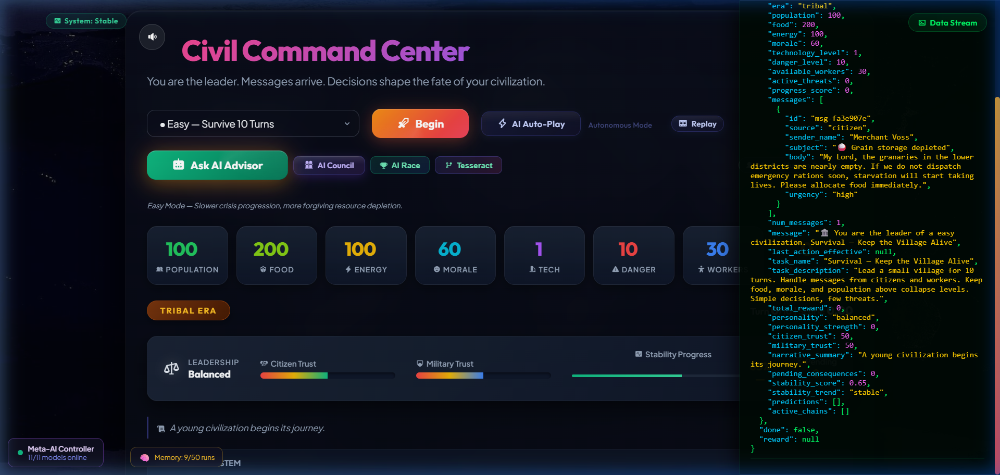
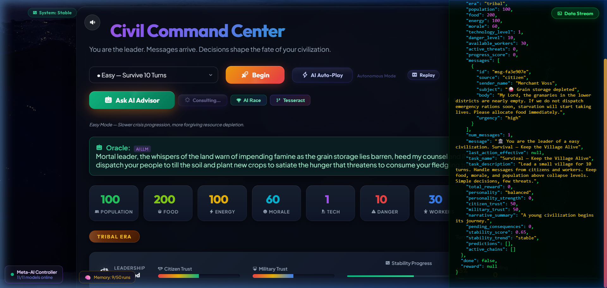

<p align="center">
  
</p>

<h1 align="center">🏛️ Civil Command Center</h1>

<p align="center">
  <strong>Lead a civilization. Shape its fate. Watch it evolve — or collapse.</strong><br/>
  <em>A message-driven RL environment where every decision echoes across time.</em>
</p>

<p align="center">
  <a href="https://github.com/meta-pytorch/OpenEnv"></a>
  <a href="https://python.org"></a>
  <a href="LICENSE"></a>
  <a href="https://fastapi.tiangolo.com"></a>
  
  
</p>

---

## What is this?

Civil Command Center drops you into the seat of a civilization's leader. You receive intelligence reports from **8 different factions** — citizens begging for food, scientists proposing research, defense officers warning about raids, traders offering deals. You pick one action per turn. Then you live with what happens next.

The twist: **consequences don't hit immediately.** Ignore a food shortage today, and 3 turns later your people revolt. Miss a defense warning, and raiders burn your settlement. Every choice ripples forward through time.

We built this as a reinforcement learning environment where the observation space isn't a grid or a set of numbers — it's **natural language messages** that agents need to actually understand. Random agents die. Greedy agents stumble. Only agents that truly *read* and *reason* can thrive.

<p align="center">
  
  <br/><em>The cinematic intro sets the stage before you take command</em>
</p>

---

## The 30-Second Pitch

```
Your civilization starts with 100 people, some food, and a lot of hope.

Messages arrive: "Grain storage depleted", "Raiders spotted on the border",
"Scientists want funding for bronze smelting"

You choose: Allocate food? Defend? Approve research? Ignore everything?

The environment processes your choice through a delayed-consequence engine.
Ignored warnings compound. Good calls cascade into golden ages.
Bad calls spiral into collapse.

Can your agent survive 30 turns and reach the Iron Age?
```

---

## Screenshots

<p align="center">
  
  <br/><em>Full gameplay interface — stats dashboard, AI advisor, data stream overlay, real-time metrics</em>
</p>

### What you're looking at:
- **Left panel**: Live civilization stats (Population, Food, Energy, Morale, Tech, Danger, Workers)
- **Center**: Action buttons, message cards from factions, narrative summaries
- **Right panel**: Raw JSON data stream — see exactly what the environment outputs
- **Bottom**: Trust meters, stability progress, era badge, leadership style tracker

---

## Quick Start

```bash
# Clone it
git clone https://github.com/YOUR_USERNAME/civil-command-center.git
cd civil-command-center

# Install
pip install -e .

# Run the server
uvicorn server.app:app --host 0.0.0.0 --port 8000

# Open the web UI
# → http://localhost:8000/web

# Or use it as a Python RL environment
python -c "
from client import CivilCommandEnv
from models import CivAction

env = CivilCommandEnv('http://localhost:8000')
result = env.reset(task_id='task_easy')
print(f'Messages: {len(result.observation.messages)}')
print(f'Population: {result.observation.population}')

result = env.step(CivAction(action_type='defend'))
print(f'Reward: {result.reward:.2f}')
"
```

---

## Why Build This?

Most RL environments give agents grids, pixels, or structured state vectors. Real-world decision-making doesn't work that way. Leaders read reports, weigh trade-offs, and deal with information that's messy, urgent, and sometimes contradictory.

We wanted an environment where:

| Traditional RL Envs | Civil Command Center |
|---|---|
| Grid/pixel observations | Natural language messages from 8 factions |
| Immediate rewards | Delayed consequences (3-turn memory system) |
| Static action meanings | Context-dependent actions (defending when there's no threat = wasted turn) |
| Single metric optimization | 12+ interacting reward signals |
| Reset = clean slate | Trust, personality, and stability carry momentum |

The result: **random agents score ~0.25, logical agents hit ~0.75, and LLMs reach ~0.85.** The environment genuinely separates agent quality.

---

## Architecture

```
┌──────────────────────────────────────────────────────────┐
│  YOUR AGENT (Python client, LLM, RL policy, etc.)        │
│  env = CivilCommandEnv("http://localhost:8000")          │
│  result = env.step(CivAction(action_type="defend"))      │
└────────────┬─────────────────────────────────────────────┘
             │  HTTP / WebSocket
┌────────────▼─────────────────────────────────────────────┐
│  FASTAPI SERVER                                           │
│  ┌─────────────────────────────────────────────────────┐ │
│  │  CivilCommandCenter Environment                      │ │
│  │  ├── Message Generator (35+ templates, 8 factions)   │ │
│  │  ├── Delayed-Consequence Memory (3-turn decay)       │ │
│  │  ├── Reward Engine (12+ dense signals)               │ │
│  │  ├── Era Progression (tribal → modern)               │ │
│  │  └── Trust & Stability System                        │ │
│  └─────────────────────────────────────────────────────┘ │
│  Isolated Sessions • Reproducible Seeds • Docker-Ready    │
└──────────────────────────────────────────────────────────┘
```

### Project Layout

```
civil_command_center/
├── server/
│   ├── app.py              # FastAPI + Web UI + AI endpoints (5800+ lines)
│   ├── environment.py      # Core simulation engine
│   ├── memory.py           # Delayed-consequence memory system
│   └── requirements.txt
├── models.py               # Pydantic models (CivAction, CivObservation)
├── client.py               # HTTP client (OpenEnv compatible)
├── inference.py            # LLM baseline agent
├── benchmark.py            # Multi-agent benchmark suite
├── data/emails.py          # 35+ message templates
├── tasks/                  # 3 difficulty levels + graders
├── tests/                  # 21 passing tests
├── assets/                 # 12 stage images + 3 videos
├── openenv.yaml            # Environment manifest
├── Dockerfile              # Container deployment
└── docs/                   # Screenshots
```

---

## The Simulation Engine

### How a Turn Works

```
Turn N:
  1. Environment generates 1-4 messages from different factions
     (content is reactive — low food = more citizen complaints)
  2. Agent sees: full civilization state + messages + memory data
  3. Agent chooses ONE of 10 actions
  4. Engine processes the action:
     a. Match action to message urgency → reward/penalty
     b. Apply delayed consequences from past ignores
     c. Natural resource decay/growth
     d. Check era advancement thresholds
     e. Check collapse conditions (morale=0 or danger=100)
  5. Generate next turn's messages (state-reactive)
  6. Return: observation + reward + done
```

### 10 Actions

| Action | What it does | When to use it |
|---|---|---|
| `allocate_food` | Feed your people | Citizens hungry, morale dropping |
| `allocate_workers` | Assign labor | Infrastructure tasks pending |
| `approve_research` | Fund science | Scientists propose breakthroughs |
| `defend` | Fortify borders | Enemy raids, border threats |
| `calm_citizens` | Address unrest | Low morale, protests |
| `accept_trade` | Take a deal | Good trade offers |
| `reject_trade` | Decline | Suspicious or bad deals |
| `invest_growth` | Build infrastructure | Expand capacity |
| `emergency_response` | Handle disasters | Floods, fires, disease |
| `ignore` | Do nothing | ⚠️ Risky — consequences compound |

### Delayed Consequences

This is the core innovation. Ignored messages don't just disappear:

```
Turn 1: "Food storage depleted" (urgency: HIGH) → You ignore it
Turn 2: Consequence enters memory with 3-turn decay
Turn 3: Morale starts dropping, citizens get restless
Turn 4: REVOLT — population drops, stability tanks
```

The memory system tracks pending consequences, trust levels, personality patterns, event chains, and generates predictive warnings.

### Era Progression

| Era | Tech Level | How to reach it |
|---|---|---|
| 🏚️ Tribal | 0-2 | Starting era |
| ⚔️ Bronze | 3-4 | Approve research + invest growth |
| 🛡️ Iron | 5-6 | Sustained research, stable resources |
| 🏭 Industrial | 7-8 | Long-term tech investment |
| 🌐 Modern | 9-10 | Maximum technology |

---

## Observation Space

Every turn, the agent receives:

| Field | Type | What it means |
|---|---|---|
| `population` | int | Core survival metric (collapse at 0) |
| `food` | int | Food reserves |
| `energy` | int | Energy reserves |
| `morale` | int | Citizen happiness (collapse at 0) |
| `technology_level` | int | Tech progress, unlocks eras |
| `danger_level` | int | External threats (collapse at 100) |
| `era` | str | Current civilization era |
| `messages` | List | Intelligence reports with source, urgency, subject, body |
| `stability_score` | float | Overall health (0-1) |
| `personality` | str | Detected leadership style |
| `citizen_trust` | float | How much citizens trust you |
| `military_trust` | float | Military confidence |
| `predictions` | List[str] | AI-generated crisis warnings |
| `pending_consequences` | int | How many delayed effects are queued |

---

## Reward Design

Dense reward shaping — 12+ signals so agents get gradient even on suboptimal plays:

| What happened | Reward |
|---|---|
| Correct action for the current crisis | +0.12 |
| Averted an urgent/critical threat | +0.25 |
| Unlocked a new era | +0.50 |
| Population milestone (+50) | +0.20 |
| Stability bonus (morale > 60) | +0.10/turn |
| Good trade accepted | +0.10 |
| Research approved | +0.15 |
| Wrong action for the situation | -0.06 |
| Ignored urgent message | -0.15 |
| Ignored critical message | -0.30 |
| **Total civilization collapse** | **-1.00** |

---

## Tasks & Grading

Three graded difficulty levels for benchmarking:

| Task | Turns | Goal | Key Weights |
|---|---|---|---|
| **Survival** (Easy) | 10 | Keep the village alive | 40% survival, 30% crisis response |
| **Growth** (Medium) | 20 | Reach Bronze Era, pop > 150 | 25% survival, 20% tech, 15% resources |
| **Era Advancement** (Hard) | 30 | Reach Iron Era+, survive wars | 25% era progress, 20% crisis |

---

## Built-in Agents

We ship 4 agents of increasing sophistication to validate that the environment is learnable:

| Agent | Strategy | Survival | Avg Score |
|---|---|---|---|
| 🎲 Random | Pick any action | ~30% | ~0.25 |
| 💰 Greedy | Maximize short-term gain | ~50% | ~0.45 |
| 🧠 Logical | Prioritize crises, then balance | ~90% | ~0.75 |
| 🤖 LLM (DeepSeek) | Full language understanding | ~95% | ~0.85 |

```bash
# Run the benchmark
python benchmark.py

# Run LLM inference
export API_KEY=your_key
python inference.py
```

---

## Web UI Features

The browser interface at `localhost:8000/web` isn't just a demo — it's a full command center:

- **Cinematic intro** with particle effects and skip controls
- **Real-time stats dashboard** with animated counters and delta indicators
- **10 action buttons** with hover effects and press feedback
- **AI Oracle** — rule-based advisor that reads your game state and gives counsel
- **AI Council** — council of multiple AI agents debating strategy
- **AI Race** — watch 3 different AI strategies compete simultaneously
- **Tesseract** — quantum timeline branching to compare "what-if" scenarios
- **Chrono-Fractal Rewind** — scrub through your turn history with a timeline slider
- **Data Stream** — toggle raw JSON observation overlay
- **Civilization Pulse Chart** — live SVG graph of morale vs danger
- **Neural Cartography** — ambient visualization at the page bottom
- **12 cinematic backgrounds** that cycle through world stages
- **Cursor particle effects** and ambient dust
- **Sound toggle** with audio feedback on actions
- **Memory system** tracking runs across sessions
- **Meta-AI Controller** monitoring 11 AI models

---

## API Reference

| Endpoint | Method | What it does |
|---|---|---|
| `/web` | GET | Interactive web UI |
| `/reset` | POST | Start a new episode |
| `/step/{session_id}` | POST | Take an action |
| `/simulate` | POST | Run full episode with built-in agent |
| `/simulate/batch` | POST | Batch run for benchmarking |
| `/api/ai/advisor` | POST | Get AI strategic advice |
| `/api/ai/decide` | POST | Let AI pick the next action |
| `/api/ai/council` | POST | Multi-agent council debate |
| `/api/ai/judge` | POST | Evaluate a decision |
| `/api/ai/chronicle` | POST | Generate narrative history |
| `/api/ai/profile` | POST | Analyze leadership profile |
| `/api/ai/decide/enhanced` | POST | Enhanced decision with reasoning |
| `/api/memory/save-run` | POST | Save episode to memory |
| `/api/memory/add` | POST | Add custom memory entry |
| `/api/meta/status` | GET | AI system health check |
| `/api/memory/status` | GET | Memory system stats |
| `/favicon.ico` | GET | App icon |

Full OpenAPI docs at `/docs` when the server is running.

---

## Docker

```bash
docker build -t civil-command-center .
docker run -p 8000:8000 civil-command-center
```

---

## Environment Variables

| Variable | Default | Purpose |
|---|---|---|
| `API_KEY` | — | LLM inference key |
| `API_BASE_URL` | `https://api.deepseek.com/v1` | LLM endpoint |
| `MODEL_NAME` | `deepseek-chat` | Model name |
| `NVIDIA_API_KEY` | — | NVIDIA NIM (web UI advisor) |
| `DEEPSEEK_API_KEY` | — | DeepSeek fallback |
| `GEMINI_API_KEY` | — | Gemini fallback |

---

## Testing

```bash
python tests/test_environment.py
# 21/21 tests passing
# Covers: reset, step, rewards, collapse, eras, graders,
# reproducibility, memory, trust, personality, predictions
```

---

## The Team

**Bedanta Chatterjee** — `rupac4530@gmail.com`

Built for the **Meta PyTorch × Hugging Face OpenEnv Hackathon**.

Framework: [OpenEnv](https://github.com/meta-pytorch/OpenEnv) by Meta & Hugging Face

License: MIT
